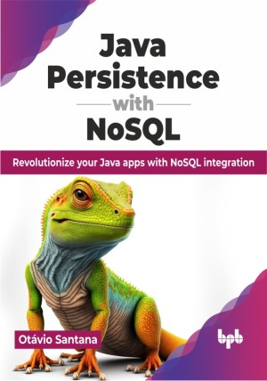

# Java Persistence with NoSQL

Unlock infinite possibilities: Java + NoSQL = Enterprise excellence

This is the repository for [Java Persistence with NoSQL
](https://bpbonline.com/products/java-persistence-with-nosql?_pos=1&_sid=10d9ace5b&_ss=r&variant=43297354252488),published by BPB Publications.

## About the Book
Java Persistence with NoSQL is a comprehensive guide that offers a unique blend of theoretical knowledge and practical implementation, making it an invaluable resource for those seeking to excel in their roles.

The book is divided into four parts, covering essential NoSQL concepts, Java principles, Jakarta EE integration, and the integration of NoSQL databases into enterprise architectures. Readers will explore NoSQL databases, comparing their strengths and use cases. They will then master Java coding principles and design patterns necessary for effective NoSQL integration. The book also discusses the latest Jakarta EE specifications, enhancing readers' understanding of Jakarta's role in data storage and retrieval. Finally, readers will learn to implement various NoSQL databases into enterprise-grade solutions, ensuring security, high availability, and fault tolerance.

With hands-on exercises, real-world examples, and best practices, this book equips professionals with the skills and knowledge needed to excel in building robust and scalable Java applications using NoSQL databases.  

## What You Will Learn
• Mastering NoSQL concepts and choosing the right database solutions.

• Integrating NoSQL databases into Java and Jakarta EE applications.

• Implementing Java design patterns for efficient data persistence.

• Leveraging Jakarta EE and MicroProfile for enhanced Java architecture.

• Designing enterprise-grade solutions with NoSQL databases for high availability.

